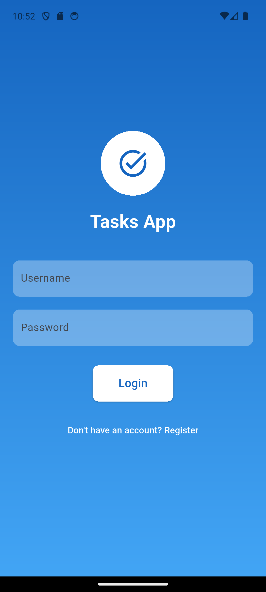
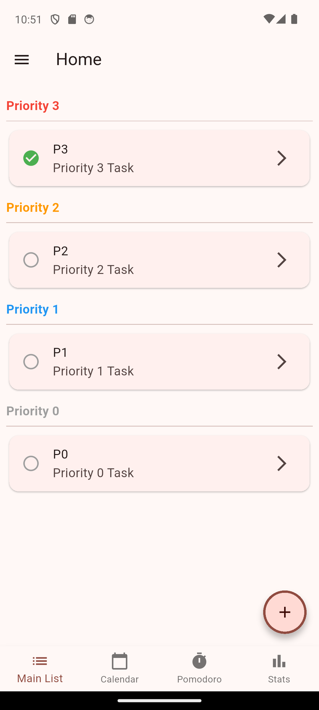
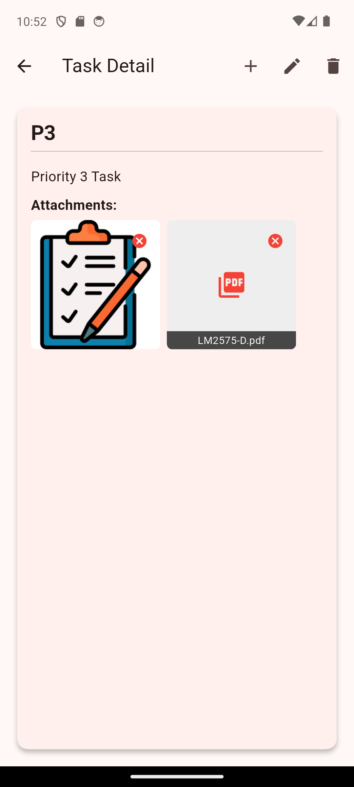
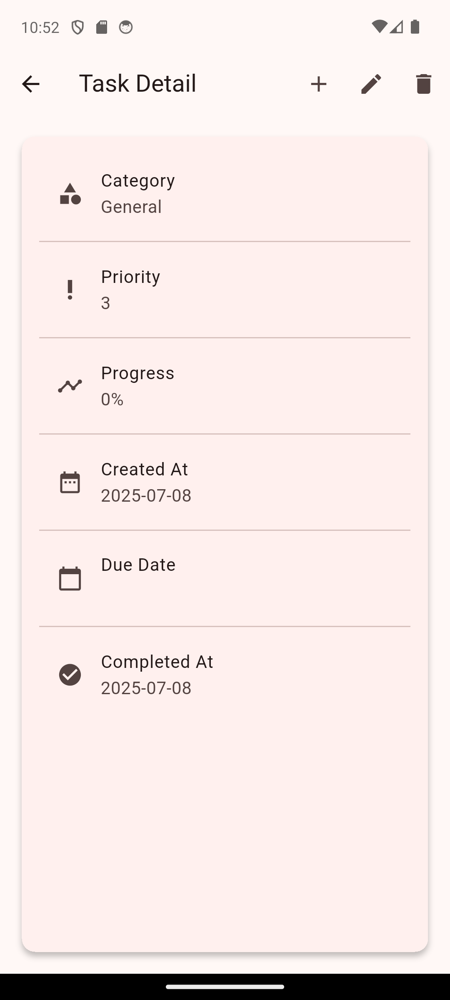
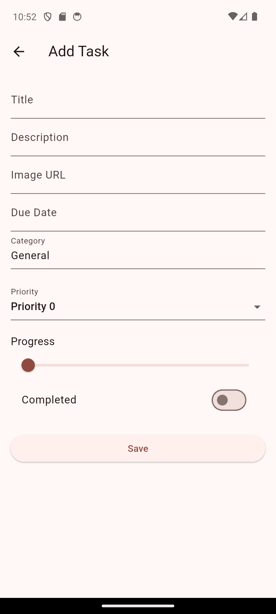

# Taskium Flutter App
A Flutter productivity app for task tracking, focus with Pomodoro sessions, and smarter time management.

## Configuration
Firebase related files that need to be added based on [Firebase Project Setup](https://firebase.google.com/docs/flutter/setup?platform=android):
* lib/firebase_options.dart
* firebase.json
* android/app/google-services.json

## Screens

| Login | Home | Calendar |
|-------|------|----------|
|  |  |  |

| Pomodoro | Detail | Detail (Part 2) |
|----------|--------|-----------------|
|  |  |  |

| Add/Edit | | |
|----------|---|---|
|  | | |